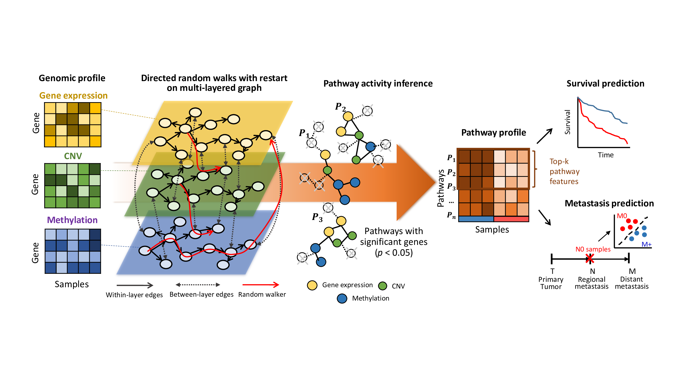

# iDRW
iDRW is an integrative pathway activity inference method using directed random walks on graph. It integrates multiple genomic profiles and transfroms them into a single pathway profile using a pathway-based integrated gene-gene graph.


# Installation
```R
library(devtools)
install_github("sykim122/iDRW")
```

# Getting started

#### 1. Load iDRW package
```R
library(iDRW)
```

Try our sample data (TCGA Bladder cancer dataset) and KEGG pathway-based gene-gene graph
```R
data("data_BLCA")
```
`data_BLCA` contains have three genomic profiles and clinical matrix.
- `exp`: RNA-Seq gene expression profile
- `cna`: CNV profile
- `meth`: DNA methylation profile
- `clinical`: clinical matrix (7 variables - `time`(overall survival days), `status`(event status), `age`, `gender`, `stageM`, `stageN`, `stageT`)

#### 2. Get multi-layered gene-gene graph
`directGraph` and `pathSet` contain directed gene-gene graph (igraph object) and the list of KEGG pathways.
Now, construct three-layered gene-gene graph from sample data. 
```R
library(igraph)
data("directGraph.KEGGgraph")
data("pathSet.KEGGgraph")

g <- directGraph 
c <- directGraph
m <- directGraph
```

Genes should be named with delimiters as below.
```R
gene_delim <- c('g.', 'c.', 'm.') # genes from RNA-Seq gene expression(g), CNV(c), Methylation(m) profile

V(g)$name <- paste(gene_delim[1],V(g)$name,sep="")
V(c)$name <-paste(gene_delim[2],V(c)$name,sep="")
V(m)$name <-paste(gene_delim[3],V(m)$name,sep="")
```

Initially, multi-layered graph simply can be constructed by the union of three graphs (the within-layer interactions are defined in `directGraph`). The between-layer interactions will be assigned in Step 3.
```R
gcm <- (g %du% c) %du% m
```

#### 3. Infer pathway activities
In this example, we select significant genes associated with survival outcome by a univariate cox regression model, adjusted by age, gender, TNM stage.
```R
class.outcome <- "time"
covs <- c("age", "gender", "stageT", "stageN", "stageM")
family <- "cox"

pa <- get.iDRWP(x=list(exp, cna, methyl), y=clinical, globalGraph=gcm, pathSet=pathSet, class.outcome=class.outcome,
                covs=covs, family=family, Gamma=0.3, Corr=FALSE)            
```
`pa$pathActivity` is a pathway profile inferred by iDRW (samples x pathways).
For more information, please refer the following document with `?get.iDRWP` or `help(get.iDRWP)`.

# References
- Kim SY, et al. Robust pathway-based multi-omics data integration using directed random walks for survival prediction in multiple cancer studies. Biology direct. 2019;14(1):8.
- Kim SY, et al. Integrative pathway-based survival prediction utilizing the interaction between gene expression and DNA methylation in breast cancer. BMC Med Genet. 2018;11:68.
- Liu W, et al. Topologically inferring pathway activity toward precise cancer classification via integrating genomic and metabolomic data: prostate cancer as a case. Sci Rep. 2015;5:13192.
- Liu W, et al. Topologically inferring risk-active pathways toward precise cancer classification by directed random walk. Bioinformatics. 2013;29(17):2169–77.
- Liu W, et al. Topologically inferring pathway activity for precise survival outcome prediction: breast cancer as a case. Molecular bioSystems. 2017;13.3:537-548.

# Contact
So Yeon Kim <jebi1771@gmail.com>
